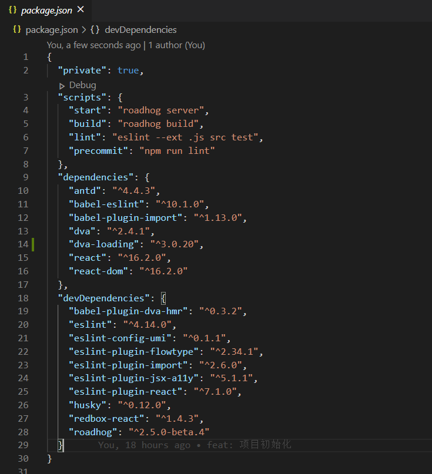
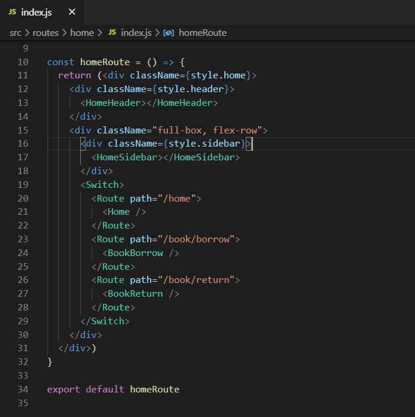
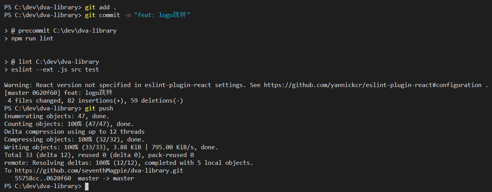

#### 1.获取项目代

```html
git clone https://github.com/seventhMagpie/dva-library.git
```

#### 2.查看package.json，安装项目依赖。



#### 3.完成一次项目需求迭代开发



#### 4.提交一次更改

```
git add . && commit -m "feat: todos"
git push
```


